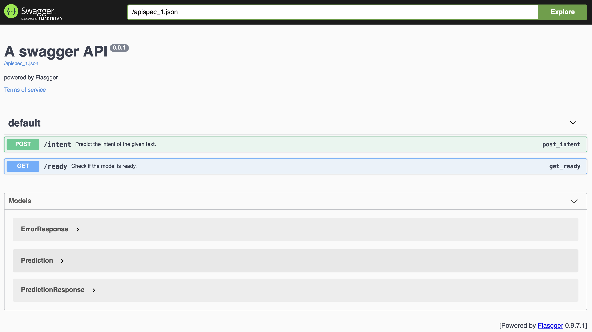
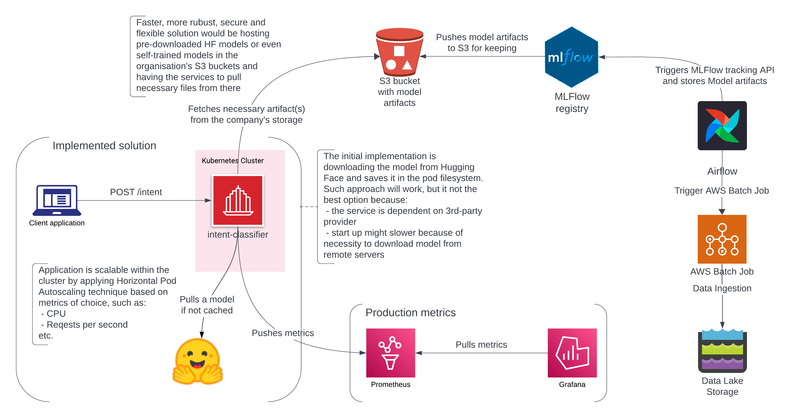

# Task description
The task is to implement a zero-shot intent classifier that can be used to provide inferencing service via an HTTP Service. During the classifier development, you should take into consideration the following points: a new set of intents, considering factors such as cost, token size, latency, and parsable output.

For more details refer to [task.md](docs/task.md).

# Research
The first approach considered for this zero-shot text classification task was testing pre-trained models from Hugging Face.

In the [notebook](notebooks/intent_zero_shot.ipynb) we used ATIS dataset as a basis to explore and test our hypothesis that HF's model will perform sufficiantly well both, inference quality and speed-wise.

# Implementation
The implementation was pretty straightforward. It is a simple Flask application exposing two **API endpoints**:
 1. a health-check `GET /ready` end-point
 2. and the main-feature end-point `POST /intent`.
The API documentation can be found in the [task.md's `api-documentation` section](docs/task.md#api-documentation).
<br>Also, when run locally, the service has `/apidoc` page available (see below).

## Features
Apart from the main functionality to message intents inference, the application features some additional features:<br>
 1. "inference classes" (intents) list can be edited in the [`config/app_config.yaml`](config/app_config.yaml).
 2. the application can be run with two parameters:
  * `--model_name`: the name of a pre-trained model to load (e.g. 'typeform/distilbert-base-uncased-mnli')
  * `--port`: the server port number
 3. at the moment, the service will reject requests that contain `text` that is longer than 60 words or 310 characters. These limitations were chosen during the EDA with ATIS dataset and represent `text`'s max(words) and max(chars) + 20%.<br>
 When receiving such an input the service will respond with code 400, the `label` "TEXT_TOO_LONG" and the `message` '"text" is too long.'.

# Running and Testing the project
## pipenv
For development environment we used `pipenv`'s with `Pipfile`. To create the environment run:
```sh
pipenv install --dev
```
Enable the environment by running:
```sh
pipenv shell
```
You should be able to run the project now with:
```sh
pipenv run python server.py
```
You can run integration tests with:
```sh
# remove -s suppress the app's output
pipenv run python -m pytest -s tests/integration
```
There's also one load test that can be run with:
```sh
pipenv run python -m pytest -s tests/load
```
## conda
For those who prefer `conda`, there's `conda_env.yaml`. Here is a bunch of shell commands to perform the tasks described in the `pipenv` section above:
```sh
# setting up the environment
conda env create -f conda_env.yml

# activate the env if you want
conda activate intent-classifier

#run the service
# remove --no-capture-output to have it "silent"
conda run -n intent-classifier --no-capture-output python server.py

#run tests
# remove -s suppress the app's output
conda run -n intent-classifier --no-capture-output python -m pytest -s tests/integration
conda run -n intent-classifier --no-capture-output python -m pytest -s tests/load
```

## Docker
Build the image:
```sh
docker build -t intent-classifier-app .
```
Run the service (note: the default port is 8080):
```sh
docker run -p 8080:8080 intent-classifier-app
```

## Swagger
The API documentation can be accessed at http://localhost:8080/apidocs/ when the service is running.



# Running the service in production

The [System Context level](https://c4model.com/#SystemContextDiagram) diagram:



Considering that our service deals with `transformers` models, it is advisable to run the application within a AWS EKS cluster deployed on a P3/P2 EC2 instance as they feature NVIDIA GPUs ([see](https://aws.amazon.com/blogs/compute/running-gpu-accelerated-kubernetes-workloads-on-p3-and-p2-ec2-instances-with-amazon-eks/)).

## Performance

Running the load test on **a consumer-grade hardware** during development featured **~11 ops**:
```sh
2024-05-13 11:20:51 - root - INFO - 300 samples inference: 26.51 seconds
2024-05-13 11:20:51 - root - INFO - The model's inference handles 11.317701609943745 ops.
```
This performance appears to be decent, considering that we plan to run the service scalable in EKS with GPUs in production.

Further production performance testing on enterprise-grade hardware should be conducted upon production rollout to ensure optimal performance.

## Things that are necessary to be implemented

The current implementation lacks metrics collection, which is essential for production-ready services. Integration with monitoring systems like Prometheus, NewRelic, or others should be implemented before deploying the service.

## Potential future improvements

To enhance the security and robustness of our service, as well as improve startup times, it is recommended to decouple the service from non-essential third-party dependencies and host pre-downloaded models within our infrastructure (such as S3 or network file systems, depending on the organization's conventional practices). If we opt for in-company trained models, this suggestion becomes a requirement.

To protect the system from malicious actors launching DDoS attacks with unrelated messages, such as "puppies and toddlers are cute," we could implement a simple Logistic Regression binary classifier using TF-IDF classified messages. This model would determine whether a message is related to travel or not, specific to our current domain.

Training this model is straightforward using our in-domain question data as positively labeled examples and synthetic data or public datasets on unrelated topics as the negative class. The model's performance is also exceptionally high, with prediction times in the single-digit milliseconds range.

Implementing such a "domain filtering" layer would safeguard our business and reduce costs.

